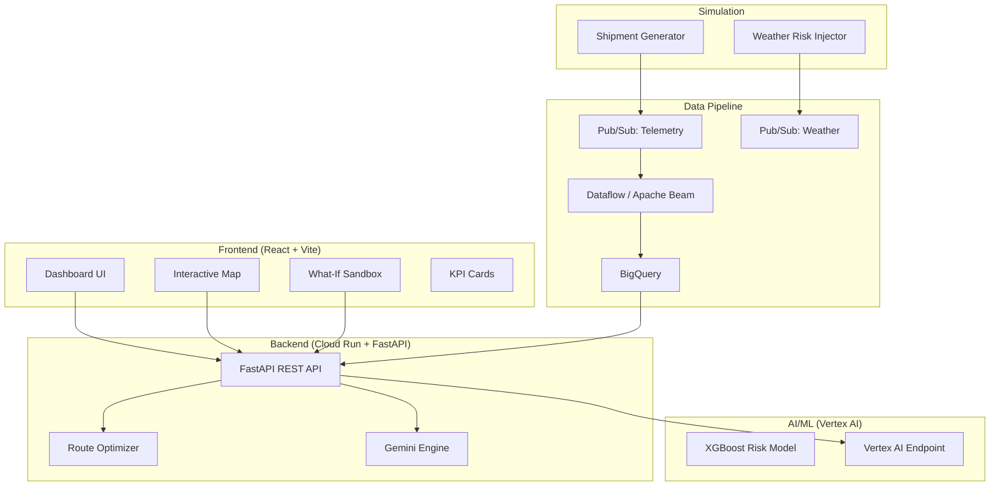

# 🛡️ ResilientRoute — Disruption Preemption & Dynamic Route Optimizer

> **Google Hack2Skill Hackathon Submission**
> AI-powered supply chain resilience for India's logistics network

[](https://cloud.google.com)
[](https://cloud.google.com/vertex-ai)
[](https://ai.google.dev)

---

## 🏗️ Architecture



## 🚀 Quick Start

### Prerequisites
- Node.js 18+, Python 3.10+
- Google Cloud SDK (`gcloud` CLI)
- A GCP project with billing enabled

### 1. Clone & Install

```bash
# Frontend
npm install

# Backend
cd backend
pip install -r requirements.txt
cd ..
```

### 2. Run Locally (Demo Mode)

**Terminal 1 — Backend:**
```bash
cd backend
python main.py
# API runs at http://localhost:8080
```

**Terminal 2 — Frontend:**
```bash
# Create .env file
echo "VITE_API_URL=http://localhost:8080" > .env

npm run dev
# Opens at http://localhost:5173
```

### 3. Deploy to Google Cloud

```bash
# Set environment
export GCP_PROJECT_ID=your-project-id
export GEMINI_API_KEY=your-gemini-key

# One-command deploy
chmod +x deploy.sh
./deploy.sh
```

## 📁 Project Structure

```
├── backend/                    # FastAPI backend (Cloud Run)
│   ├── main.py                # API endpoints
│   ├── models.py              # Pydantic models
│   ├── config.py              # Configuration
│   ├── seed_data.py           # Indian trade lane data
│   ├── services/
│   │   ├── optimizer.py       # Multi-objective route optimizer
│   │   └── gemini_engine.py   # Gemini AI rationale generator
│   ├── requirements.txt
│   └── Dockerfile
├── simulation/                 # Data simulation scripts
│   ├── shipment_generator.py  # Pub/Sub telemetry publisher
│   └── weather_risk_injector.py
├── dataflow/                   # Apache Beam pipeline
│   ├── pipeline.py            # Streaming enrichment pipeline
│   └── schemas.sql            # BigQuery table schemas
├── notebooks/
│   └── vertex_training.ipynb  # ML model training & deployment
├── src/                        # React frontend
│   └── app/
│       ├── App.tsx            # Main app with backend integration
│       ├── api/index.ts       # API service layer
│       ├── components/
│       │   ├── HeroMap.tsx    # Interactive India map
│       │   ├── DetailSidebar.tsx
│       │   ├── TopBar.tsx     # With demo mode controls
│       │   ├── KPIOverlay.tsx # Dynamic KPI cards
│       │   ├── WhatIfPanel.tsx
│       │   └── LoadingSkeleton.tsx
│       ├── data/mockData.ts
│       └── types.ts
├── deploy.sh                   # One-command GCP deployment
└── README.md
```

## 🔑 API Endpoints

| Method | Endpoint | Description |
|--------|----------|-------------|
| GET | `/shipments` | All active shipments + lanes |
| GET | `/shipment/{id}` | Single shipment detail |
| POST | `/shipment/{id}/reroute_options` | Compute alternatives (fastest/cheapest/greenest) |
| POST | `/shipment/{id}/approve` | Approve reroute, update state |
| POST | `/whatif` | Simulate disruption, get impact analysis |
| GET | `/kpi` | Dashboard KPI stats |
| POST | `/demo/speed` | Set demo animation speed |
| POST | `/demo/tick` | Advance demo simulation |

## 🌟 Key Features

### 🗺️ Interactive India Map
- Real-time shipment tracking on Indian Ocean trade lanes
- Risk-coloured lane ribbons with pulse animations
- Click-to-select shipment with sliding detail panel

### 🧪 What-If Sandbox (★ Wow Factor)
- Toggle to simulation mode
- Click anywhere on the map to drop a disruption (cyclone, port strike)
- Instantly see: affected shipments, risk re-computation, AI reroutes
- Bottom panel with top-3 recommended alternatives

### 🤖 AI-Powered Decisions
- **Vertex AI**: XGBoost delay prediction model
- **Gemini**: Natural-language rationale for every recommendation
- **Multi-Objective Optimizer**: Fastest, cheapest, lowest-carbon routes

### 📊 Dynamic KPIs (Indian Currency)
- Active shipments, at-risk count
- Cost saved (₹ Crores), CO₂ avoided (tonnes)
- Disruptions preempted today

### 🎬 Demo Mode
- Hidden toggle in top bar speeds up time (1×/5×/10×)
- Shipments visibly traverse lanes in seconds
- Perfect for judge demonstrations

## 🇮🇳 India-Centric Design

All routes use exclusively Indian ports and hubs:

| Category | Locations |
|----------|-----------|
| **Major Ports** | Mumbai (JNPT), Mundra, Chennai, Visakhapatnam, Kolkata, Kochi, Paradip |
| **Inland ICDs** | Delhi (Tughlakabad), Bengaluru (Whitefield), Hyderabad, Ahmedabad |
| **International** | Colombo, Dubai (Jebel Ali), Singapore, Chittagong, Salalah |

## ☁️ Google Technologies Used

| Technology | Usage |
|-----------|-------|
| **Cloud Run** | Backend API hosting (auto-scaling) |
| **Vertex AI** | XGBoost risk prediction model endpoint |
| **Gemini** | Natural-language explainability engine |
| **BigQuery** | Analytical data warehouse for telemetry |
| **Pub/Sub** | Real-time event streaming |
| **Dataflow** | Apache Beam streaming pipeline |
| **Firestore** | Real-time shipment state store |
| **Cloud Build** | CI/CD for Cloud Run deployments |
| **Maps API** | Route geometry reference |

## 🎯 120-Second Demo Script

> **For hackathon judges — follow this flow:**

1. **0:00–0:15** — Open the dashboard. Point out the animated loading skeleton. Note the India-centric map with 10 trade lanes and 8 active shipments.

2. **0:15–0:30** — Click the red pulsing dot (RRF-4501, Mumbai→Singapore). The sidebar slides in showing 87% risk. Scroll to see 3 AI-generated alternatives with Gemini rationale.

3. **0:30–0:50** — Click "Kochi–Salalah Divert". Read the Gemini explanation citing Cyclone Mandous. Click **Approve Reroute** — watch confetti animation and risk drop to 18%.

4. **0:50–1:10** — Toggle **What-If Sandbox**. Click near Colombo on the map. A red disruption pulse appears. Watch lanes re-colour. The What-If panel shows "5 shipments at risk" with AI recommendations.

5. **1:10–1:30** — Enable **Demo Mode** (top bar). Set speed to 10×. Watch shipment markers animate along lanes in real-time. Note KPI cards updating.

6. **1:30–2:00** — Highlight the architecture: Cloud Run API, Vertex AI model, Gemini rationale, BigQuery analytics. Note the ₹ Crore formatting and Indian port coverage. End with the cost savings number.

## 📄 License

Built for Google Hack2Skill Hackathon. MIT License.

---

**Built with ❤️ using Google Cloud AI**